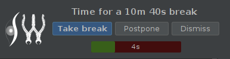
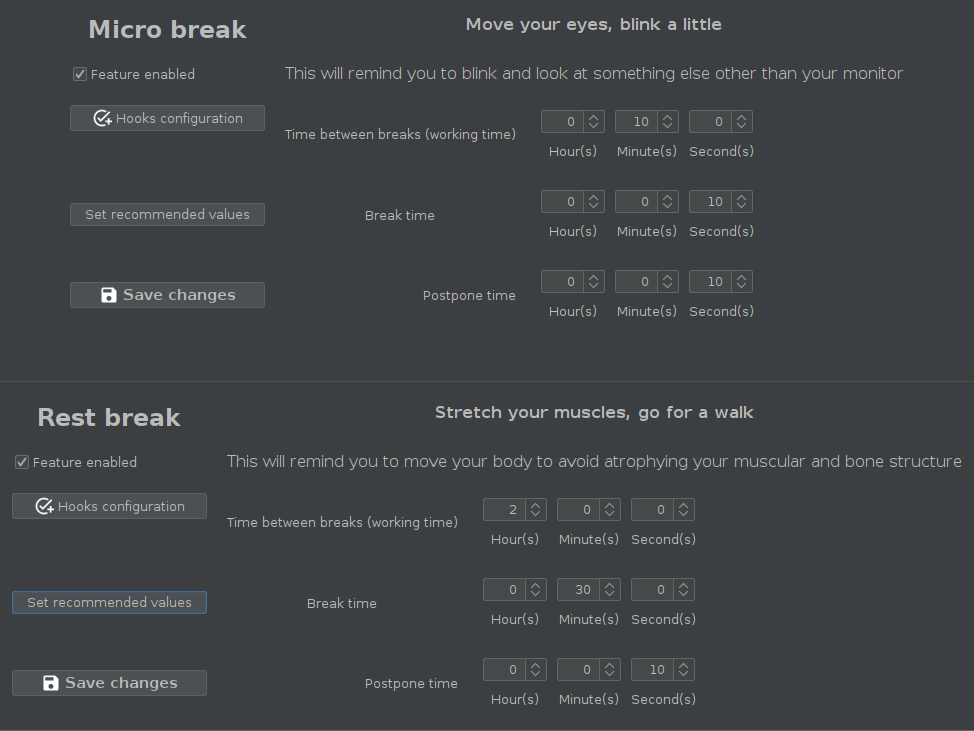
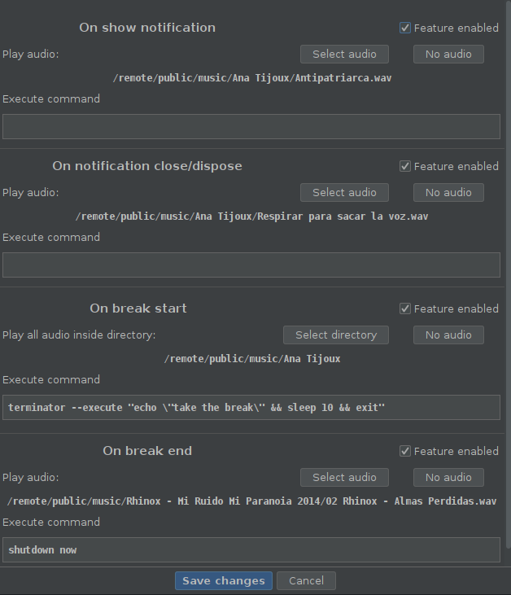
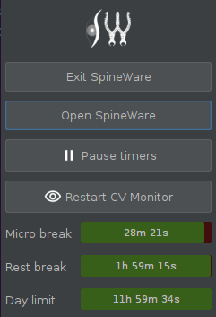

<!--
Copyright (c) 2020. Benjamín Antonio Velasco Guzmán
Author: Benjamín Antonio Velasco Guzmán <9benjaminguzman@gmail.com>

This program is free software: you can redistribute it and/or modify
it under the terms of the GNU General Public License as published by
the Free Software Foundation, either version 3 of the License, or
(at your option) any later version.

This program is distributed in the hope that it will be useful,
but WITHOUT ANY WARRANTY; without even the implied warranty of
MERCHANTABILITY or FITNESS FOR A PARTICULAR PURPOSE.  See the
GNU General Public License for more details.

You should have received a copy of the GNU General Public License
along with this program.  If not, see <http://www.gnu.org/licenses/>.
-->

# SpineWare

A Java application to take care of your health while you're using the computer.

## Main features

### Timer to let you know you've been working hard and need break:

- The program has 3 types of breaks:
  + **micro break**: To relax the eyes and move a little. Sometimes while we've been working hard for a long time we
    blink less than usual and don't move much. This will remind you to do so.
  + **rest break**: To stretch your muscles. You need to move from time to time to avoid atrophying your muscular and
    bone structure.
  + **day break**: To stop working. It is good you are passionate about your job but still, you have to rest and sleep.

- Each break can have configured hooks that can be executed when a break ends/starts.

This feature is specifically useful to remind you with a sound (along with a notification) to take a break or play music
while you're taking the break.

A hook can be configured to execute commands too!

The status for each break is shown in the system tray.

**WARNING** and **TODO**: If your system does not support Systray, you can't use SpineWare.

**Known list of incompatible Operatives Systems**:

- Ubuntu 18.04

Please, if you try SpineWare and discover that your SO is not compatible, try making a GitHub issue.

### List of exercises you can do while taking a break

**TODO**: Complete this docs & make the feature.

### Computer Vision program to check if you're getting too close to the screen

Haven't you had that sensation of knowing that you're in a bad posture but do not remember how you got it? This feature
can help you out to avoid adopting that bad posture.

**TODO**: SCREENSHOT HERE, complete the feature.

## Contributors

Main contributor is [Benjamín Guzmán](https://github.com/BenjaminGuzman) who as a developer is concerned about the
health habits of developers while using a computer.

This software is under the GPLv3 License, thus you're free to modify and improve the code.

There are three main areas where you can contribute:

- **Help to bring SpineWare to Windows and MacOS**: We love free software and mainly use GNU/Linux to run and test
  SpineWare, but we believe is part of the freedom of the user to choose what software to use and in which platform. A
  great advantage is that SpineWare is written in Java.
- **Translations**: Currently SpineWare is available only in 1 language: English. It'd be great if you contribute with
  translations of the [messages.properties](src/main/resources/bundles)
- **Ideas & code**: I (Benjamín Guzmán) wrote SpineWare according to my needs as developer, but maybe you've some other
  needs & ideas, you can contribute with that and even modify the source code to make it a reality.

## Dependencies

- Java 8, SpineWare's core programming language

- [FlatLaf](https://github.com/JFormDesigner/FlatLaf) to have a nice Look & Feel

- [OpenCV](https://github.com/opencv/opencv) mainly for the CV features.

- [javalayer](http://www.javazoom.net/javalayer/javalayer.html) to add support for mp3 audio files (specially in hooks
  config)

- [commons-cli](https://commons.apache.org/proper/commons-cli/) to parse cli arguments

Possible dependencies:

- [SystemTray](https://github.com/dorkbox/SystemTray) to have a better system tray more compatible & modern.

- [log4j2](https://logging.apache.org/log4j/2.x/) to have better logging mechanisms

## Troubleshooting

### SpineWare won't start anymore

To avoid collisions, when an instance of SpineWare is created, it creates a `sw.lock` file in the `java.io.tmpdir` with
no permissions to anyone (POSIX `---------`). The file should be deleted when the JVM exits gracefully.

If something weird happens, the `sw.lock` file may not be deleted. In such case **you can safely delete it**.

Delete it with `rm -f /tmp/sw.lock` on *nix systems, use the `-f` flag to force the removal of the file as the command
will ask for confirmation since you don't have permission to read/write the file.

**If that doesn't work, try rebooting your system**. This should delete the file as it is located in the temp
directory (unless you've modified your SO behaviour).

### Logs and errors

**Only `SEVERE`, `ERROR` & `WARNING`** logs will be saved in a temporary file in the temp folder.

You can see those logs if something is not working correctly, e. g. a configured audio hook is not playing.

If you want you can open a GitHub issue and upload the log.

**All other logs will be logged to `stdout`**.

### Logs and errors for execution hooks

When a hook command is executed, the

- **stdout** of the command is redirected to the file `SW_hooks_stdout.log` inside the temp directory
- **stderr** of the command is redirected to the file `SW_hooks_stderr.log` inside the temp directory

These files are **NOT overwritten** but **appended**, therefore, there you can see all the logs for all executions. (
since you powered up your computer, remember they're in the temp dir).