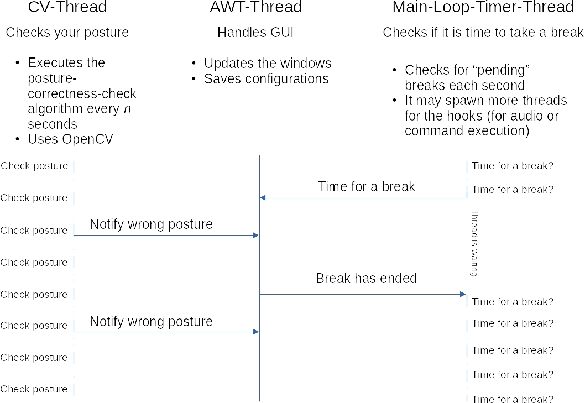

<!--
Copyright (c) 2020. Benjamín Antonio Velasco Guzmán
Author: Benjamín Antonio Velasco Guzmán <9benjaminguzman@gmail.com>

This program is free software: you can redistribute it and/or modify
it under the terms of the GNU General Public License as published by
the Free Software Foundation, either version 3 of the License, or
(at your option) any later version.

This program is distributed in the hope that it will be useful,
but WITHOUT ANY WARRANTY; without even the implied warranty of
MERCHANTABILITY or FITNESS FOR A PARTICULAR PURPOSE.  See the
GNU General Public License for more details.

You should have received a copy of the GNU General Public License
along with this program.  If not, see <http://www.gnu.org/licenses/>.
-->

# SpineWare

A Java application to take care of your health while you're using the computer.

## Main features

### Timer to let you know you've been working hard and need break:

- SpineWare has 3 types of breaks:
  + **micro break**: To relax the eyes and move a little. When you've been working hard for a long time you blink less
    than usual and stress your eyes. This will remind you to avoid doing so.
  + **rest break**: To stretch your muscles. You need to move from time to time to avoid atrophying your muscular and
    bone structure.
  + **day break**: To stop working. It is good you are passionate about your job but still, you have to rest and sleep.

When it's time for a break, a notification will show up in the corner you selected in the configuration. The
notification will look like this

Notifications and breaks configuration

Each break can have configured hooks that can be executed when the break starts or ends.

This feature is specifically useful to remind you with a sound (along with the notification) to take a break or play
music while you're taking the break.

**A hook can be configured to execute commands too!**

The status for each break is shown in the system tray.

**WARNING** and **TODO**: If your system does not support Systray, you can't use SpineWare.

**Known list of incompatible Operative Systems**:

- Ubuntu 18.04

Please, if you try SpineWare and discover that your SO is not compatible, make a GitHub issue.

### Computer Vision program to check if you're in a good posture

Haven't you had that sensation of knowing that you're in a bad posture but do not remember how you got it? This feature
can help you to avoid adopting that bad posture.

This is done by "calibrating" the camera with a very naive algorithm, and then a process is run in background to check
your posture. See bottom of this document for more information about how this process.

As said, the "calibration" algorithm is very naive, and the distance calculations may be wrong, specially if your webcam
distorts a lot the image. The naive algorithm was chosen instead of a more professional and accurate like
[Zhang's](https://www.researchgate.net/profile/Wilhelm-Burger/publication/303233579_Zhang's_Camera_Calibration_Algorithm_In-Depth_Tutorial_and_Implementation/links/5eaad8c9a6fdcc70509c3c9b/Zhangs-Camera-Calibration-Algorithm-In-Depth-Tutorial-and-Implementation.pdf)
famous algorithm because:

1. Not all users have a chessboard (or similar) required to perform calibration
2. For the user is much easier to do the calibration with the naive algorithm
3. Zhang's algorithm is more complex, even though OpenCV helps a lot. Check
   [this](https://opencv-java-tutorials.readthedocs.io/en/latest/09-camera-calibration.html) and
   [this](https://docs.opencv.org/4.x/dc/dbb/tutorial_py_calibration.html)
4. Zhang's algorithm calculates several parameters that are not so critical for this app
   (in most cases, let's hope your camera doesn't distort image too much 🤞)

The naive algorithm will ask you to take different pictures of your face at different distances

Copyright &copy; 2021 Benjamín Antonio Velasco Guzmán. Image NOT under any free license, i.e. you're strictly prohibited
from modifying, copying, distributing, disseminating, or processing this picture in any way under any circumstances.

**Note**: This feature is not perfect (it's not easy to check posture by just a webcam), so it may have false negatives,
so don't take this so seriously and don't get stressed about it, that's the last thing we want. If you encounter any
problem while using this software, feel free to open a Github Issue.

Note 2: This feature uses OpenCV `Mat#release()` often, even though it is not necessary because C++ destructor
(called when object is out of scope and marked for deletion) will call release
([reference](https://docs.opencv.org/4.5.4/d3/d63/classcv_1_1Mat.html#a1b2ae166171f6a7306cf09ff67a2153f)).

Nevertheless, `Mat#release()` is used because Garbage Collection may be late or delayed, but more important because we
don't want garbage collection happening much often. It could slow down the application, and give the appearance there is
some kind of memory leak. See Issue #8

## Privacy

Neither the images, nor the processed data (like posture analytics, hooks configuration, logs, etc...) is saved in any
way, not in your computer, not in an external server. **SpineWare values your privacy**, you can check the source code
to be sure.

## Contributors

Main contributor is [Benjamín Guzmán](https://github.com/BenjaminGuzman) who as a developer is concerned about the
health habits of developers while using a computer.

This software is under the GPLv3 License, thus you're free to modify and improve the code.

There are three main areas where you can contribute:

- **Help to bring SpineWare to Windows and MacOS**: I love free software and mainly use GNU/Linux to run and test
  SpineWare, but I believe is part of the user's freedom to choose what software to use and in which platform. A great
  advantage is that SpineWare is written in Java.
- **Translations**: Currently SpineWare is available only in 2 languages: English and Spanish. It'd be great if you
  contribute with translations of the [messages.properties](src/main/resources/bundles)
- **Ideas & code**: I (Benjamín Guzmán) wrote SpineWare according to my needs as developer, but maybe you've other needs
  or ideas. You can contribute by simply suggesting changes or by modifying the source code to make them a reality.

## Dependencies

- Java 8, SpineWare's core programming language

- [FlatLaf](https://github.com/JFormDesigner/FlatLaf) to have a nice Look & Feel

- [OpenCV](https://github.com/opencv/opencv) mainly for the CV features.

- [javalayer](http://www.javazoom.net/javalayer/javalayer.html) to add support for mp3 audio files (specially in hooks
  config)

- [commons-cli](https://commons.apache.org/proper/commons-cli/) to parse cli arguments

Possible dependencies:

- [SystemTray](https://github.com/dorkbox/SystemTray) to have a better system tray more compatible & modern.

## Troubleshooting

### SpineWare won't start anymore

To avoid collisions, when an instance of SpineWare is created, it creates a `sw.lock` file in the `java.io.tmpdir` with
no permissions to anyone (POSIX `---------`). The file should be deleted when the JVM exits gracefully.

If something weird happens, the `sw.lock` file may not be deleted. In such case **you can safely delete it**.

Delete it with `rm -f /tmp/sw.lock` on *nix systems, use the `-f` flag to force the removal of the file as the command
will ask for confirmation since you don't have permission to read/write the file.

**If that doesn't work, try rebooting your system**. This should delete the file as it is located in the temp
directory (unless you've modified your SO behaviour).

### Logs and errors

**Only `SEVERE`, `ERROR` & `WARNING`** logs will be saved in a temporary file in the temp folder.

You can see those logs if something is not working correctly, e. g. a configured audio hook is not playing.

If you want you can open a GitHub issue and upload the log.

**All other logs will be logged to `stdout`**.

### Logs and errors for execution hooks

When a hook command is executed

- **stdout** of the command is redirected to the file `SW_hooks_stdout.log` inside the temp directory
- **stderr** of the command is redirected to the file `SW_hooks_stderr.log` inside the temp directory

These files are **NOT overwritten** but **appended**, therefore, you can see all the logs for all executions.
(Starting from when you powered up your computer, remember they're in the temp dir).

## How it works

### Threading

The following diagram gives an overview of the threading stuff used in SpineWare

The diagram is self-explanatory.

#### Q & A

- Is it better to use a single main loop timer thread than creating a timer for each break?

Yes. It is most efficient in most cases. It may have no difference or may be even worse if the user configures a single
break, but because the application is meant to have multiple breaks it was done that way. Remember each timer creates a
thread, it is better to have a single thread (a single main loop timer) than multiple timers.

- Why don't put use a single thread for the posture checker and the main timer loop?

Since the posture checker does some calculations more expensive than the calculations done in the main loop timer, it
was preferred to do those "expensive" calculations in a separate thread.

- Why Swing and not JavaFX?

I tried to use JavaFX, I think GUI programming would have been easier, but it doesn't have some features required by
SpineWare. For example, you cannot have an undecorated Stage of type POPUP (which allows not to show the application
icon in the taskbar).

- Why singleton pattern is implemented differently in some classes?

Let's take as an example the `CVUtils` class and the `CVPrefsManager`. Both classes use the singleton pattern, the
former throws an exception in the constructor if an instance already exists, while the latter has only static members,
why is that?

That was done for performance, the `CVUtils` **loads** some of the **OpenCV** stuff so it was preferred just to load
that stuff when needed (when explicitly calling the constructor) not when the JVM's ClassLoader loads the class as it is
done with the `CVPrefsManager` because all members are static.

It really doesn't impact much the overall performance and could be done either way.